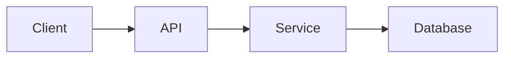
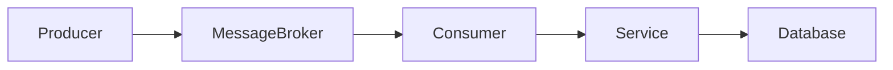

# Data Flow Analysis Skill

## Purpose

Analyze the actual implementation and generate a data flow representation using Mermaid.

The diagram MUST represent the real implementation.

---

# 1. Analyze Application Entry Points

Identify:

- HTTP endpoints
- gRPC endpoints
- event consumers
- scheduled jobs
- message consumers
- CLI commands
- background workers

---

# 2. Trace Request Flow

For each important flow determine:

```text
Client
  ↓
Entry Point
  ↓
Middleware
  ↓
Handler / Controller
  ↓
Service / Use Case
  ↓
Repository
  ↓
Database / External Service
```

Adapt the flow to the actual architecture.

---

# 3. Identify Data Stores

Identify:

- PostgreSQL
- MySQL
- SQL Server
- HBase
- MongoDB
- Redis
- Elasticsearch
- object storage
- vector database
- other storage systems

Only document systems that actually exist.

---

# 4. Identify External Dependencies

Identify:

- external APIs
- authentication providers
- payment services
- messaging systems
- third-party services
- internal enterprise services

---

# 5. Identify Communication Pattern

Determine whether communication is:

- synchronous REST
- synchronous gRPC
- asynchronous Kafka
- asynchronous queue
- event-driven
- scheduled
- batch

---

# 6. Generate Mermaid

Use Mermaid.

For synchronous flow:



For asynchronous flow:



---

# 7. Data Flow Levels

Generate three levels when useful.

## Level 1 — System Context

Show:

```text
Client
Application
External Systems
Database
```

## Level 2 — Application Flow

Show:

```text
API
Authentication
Service
Repository
Cache
Database
```

## Level 3 — Detailed Flow

Show important business processing.

Do not overcomplicate the diagram.

---

# 8. Validation

Verify that every Mermaid component exists in the implementation.

For each component determine the evidence source.

Example:

```text
Redis
Evidence: REDIS_HOST + Redis client implementation

Kafka
Evidence: KAFKA_BROKERS + Kafka consumer

PostgreSQL
Evidence: DATABASE_URL + PostgreSQL driver
```

---

# 9. Output

Update:

```text
docs/04-data-flow.md
```

Include:

- system context
- high-level flow
- request flow
- processing flow
- external integration
- error flow
- Mermaid diagram

Report any unknown architectural information.