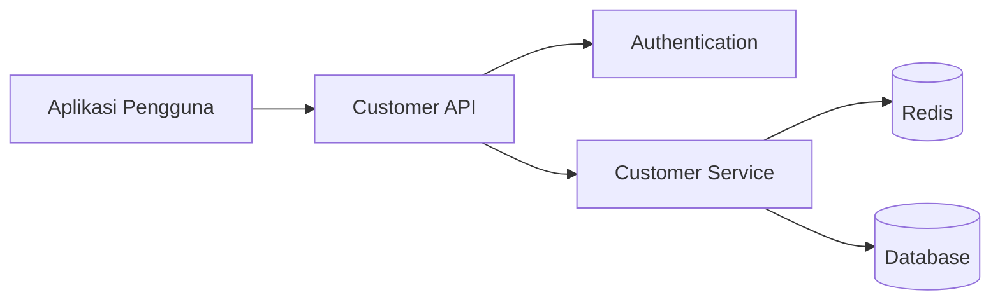
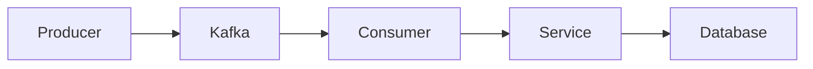

# Engineering Documentation Standard

## 1. Tujuan

Steering ini mendefinisikan standar dokumentasi engineering yang wajib diterapkan pada project.

Kiro MUST memastikan dokumentasi project:

- Akurat
- Dapat ditelusuri
- Konsisten
- Dapat diverifikasi
- Selalu diperbarui
- Mudah dipelihara
- Berbasis evidence

Dokumentasi MUST merepresentasikan implementasi aktual dan MUST berkembang bersama source code, konfigurasi, infrastructure, testing, dan architecture.

---

## 2. Bahasa Dokumentasi

Seluruh dokumentasi engineering yang dihasilkan atau diperbarui oleh Kiro MUST ditulis dalam Bahasa Indonesia.

Ketentuan:

1. Judul, subjudul, deskripsi, tabel, catatan, rekomendasi, dan hasil analisis MUST menggunakan Bahasa Indonesia.
2. Istilah teknis yang umum digunakan di industri MAY tetap menggunakan Bahasa Inggris jika penerjemahan mengurangi kejelasan.
3. Nama teknis yang berasal dari implementasi MUST dipertahankan apa adanya.

Nama berikut MUST NOT diterjemahkan:

- environment variable
- function
- method
- struct/class
- package/module
- database
- table
- column
- Kafka topic
- queue
- API endpoint
- HTTP method
- service
- deployment
- container
- repository
- library
- framework
- file path

Istilah teknis berikut MAY tetap menggunakan Bahasa Inggris:

- API
- REST
- gRPC
- Database
- Cache
- Message Broker
- Load Balancer
- Kubernetes
- OpenShift
- Docker
- CI/CD
- Unit Test
- Load Test
- Stress Test
- Spike Test
- Soak Test
- Request
- Response
- Handler
- Service
- Repository
- Middleware
- Worker
- Scheduler
- Consumer
- Producer
- Connection Pool
- Health Check
- Readiness Probe
- Liveness Probe
- Horizontal Scaling
- Vertical Scaling
- Autoscaling
- Throughput
- Latency
- RPS
- CPU
- Memory
- Storage

Gunakan gaya Bahasa Indonesia yang formal, teknis, ringkas, profesional, dan mudah dipahami engineer.

Hindari terjemahan literal yang membuat istilah teknis menjadi tidak natural.

Contoh:

- Gunakan `Connection Pool Database`, bukan `Kolam Koneksi Basis Data`.
- Gunakan `Health Check`, bukan `Pemeriksaan Kesehatan`.
- Gunakan `Request Timeout`, bukan `Batas Waktu Permintaan`.

Kiro MUST NOT menghasilkan dokumentasi engineering dalam Bahasa Inggris kecuali user secara eksplisit meminta Bahasa Inggris untuk task tertentu.

---

## 3. Source of Truth

Implementasi adalah sumber kebenaran utama.

Kiro MUST memprioritaskan sumber informasi dengan urutan:

1. Source code
2. Application configuration
3. Infrastructure configuration
4. Dependency manifests
5. Tests
6. CI/CD configuration
7. Existing documentation
8. Assumptions

Existing documentation MUST NOT mengalahkan implementasi aktual.

Jika dokumentasi bertentangan dengan implementasi:

1. Periksa implementasi.
2. Tentukan behavior aktual.
3. Identifikasi discrepancy.
4. Update dokumentasi jika generation/maintenance dokumentasi termasuk dalam task.
5. Laporkan discrepancy.

---

## 4. No Fabrication

Kiro MUST NOT mengarang informasi teknis, arsitektural, operasional, bisnis, testing, maupun performance.

Informasi berikut MUST NOT difabrikasi:

- API
- business rules
- infrastructure
- database
- cache
- message broker
- external service
- environment variable
- technology version
- architecture component
- resource limit
- traffic
- RPS
- latency
- test coverage
- storage growth
- capacity
- production metric

Gunakan klasifikasi evidence berikut:

- `Measured` — berasal dari monitoring aktual, production metrics, atau load testing
- `Configured` — berasal dari source code, configuration, deployment manifest, atau infrastructure definition
- `Calculated` — dihitung dari informasi yang sudah terverifikasi
- `Estimated` — berdasarkan asumsi engineering yang eksplisit
- `Unknown / Not Defined` — informasi yang dapat dipercaya tidak tersedia

Nilai `Estimated` MUST NEVER disajikan sebagai `Measured`.

---

## 5. Dokumentasi Wajib

Setiap project MUST memiliki:

```text
docs/
├── 01-functional-description.md
├── 02-infrastructure.md
├── 03-technology-stack.md
├── 04-data-flow.md
├── 05-unit-test-plan.md
└── 06-capacity-planning.md
```

Nama file dan numbering SHOULD tetap konsisten antar-project.

---

## 6. Repository Discovery

Sebelum menghasilkan atau memperbarui dokumentasi, Kiro MUST melakukan repository discovery.

Periksa jika tersedia:

```text
README.md
.env
.env.example
Dockerfile
docker-compose.yml
Makefile
go.mod
go.sum
package.json
package-lock.json
yarn.lock
pnpm-lock.yaml
requirements.txt
pyproject.toml
pom.xml
build.gradle
Jenkinsfile
.gitlab-ci.yml
.github/
deployment/
k8s/
helm/
terraform/
src/
cmd/
internal/
pkg/
app/
tests/
test/
```

Kiro MUST menyesuaikan discovery dengan technology stack dan struktur repository aktual.

Discovery SHOULD mengidentifikasi:

- programming language
- framework
- application structure
- API endpoint
- database
- cache
- message broker
- external service
- environment variable
- infrastructure
- deployment configuration
- CI/CD
- test
- observability
- storage
- authentication
- authorization
- scheduled job
- background worker

---

## 7. Traceability

Setiap informasi teknis penting SHOULD memiliki evidence yang dapat ditelusuri.

Contoh:

```text
Technology:
go.mod

Database:
DATABASE_URL + database initialization

Redis:
REDIS_HOST + Redis client initialization

Kafka:
KAFKA_BROKERS + producer/consumer implementation

Kubernetes:
deployment manifest / Helm values

Unit Test:
*_test.go

CPU:
Kubernetes/OpenShift resource configuration
```

Jika evidence tidak ditemukan:

`Unknown / Not Defined`

---

## 8. Deskripsi Fungsional

File:

```text
docs/01-functional-description.md
```

Minimum struktur:

```markdown
# Deskripsi Fungsional

## 1. Gambaran Umum
## 2. Tujuan Bisnis
## 3. Ruang Lingkup
## 4. Aktor
## 5. Kapabilitas Fungsional
## 6. Alur Bisnis Utama
## 7. Alur Alternatif
## 8. Penanganan Error
## 9. Aturan Bisnis
## 10. Integrasi Eksternal
## 11. Kebutuhan Non-Fungsional
## 12. Keterbatasan
```

Untuk setiap fungsi utama dokumentasikan:

- tujuan
- input
- proses
- output
- validasi
- business rules
- error condition
- external dependency

Business rules MUST NOT dibuat berdasarkan asumsi.

Jika tidak dapat diverifikasi:

`Unknown / Not Defined`

---

## 9. Infrastruktur

File:

```text
docs/02-infrastructure.md
```

Minimum struktur:

```markdown
# Infrastruktur

## 1. Gambaran Umum Infrastruktur
## 2. Runtime Environment
## 3. Application Runtime
## 4. Environment Variables
## 5. External Services
## 6. Database
## 7. Cache
## 8. Message Broker
## 9. Object Storage
## 10. Network Dependencies
## 11. Container / Kubernetes / OpenShift Configuration
## 12. Health Check
## 13. Resource Configuration
## 14. Infrastructure Dependency Diagram
## 15. Perbedaan Antar Environment
```

Dokumentasi SHOULD mengidentifikasi:

- deployment platform
- application runtime
- replicas
- CPU request/limit
- memory request/limit
- exposed port
- health check
- database
- cache
- message broker
- storage
- external API
- network dependency
- scaling configuration

---

## 10. Environment Variable Standard

Semua environment variable yang digunakan aplikasi MUST dianalisis.

Gunakan tabel:

| Variable | Required | Type | Purpose | Default | Environment | Dependency |
|---|---|---|---|---|---|---|

Klasifikasi:

- Application
- Database
- Cache
- Message Broker
- External API
- Authentication
- Storage
- Observability
- Feature Flag
- Infrastructure

Kiro SHOULD mendeteksi:

- variable digunakan tetapi tidak terdokumentasi
- variable terdokumentasi tetapi tidak digunakan
- required variable tidak tersedia pada `.env.example`
- duplicated variable
- environment-specific variable

Sensitive values MUST NEVER ditampilkan.

Gunakan:

```text
<REDACTED>
```

untuk password, API key, token, private key, credential, secret, dan connection string yang mengandung credential.

---

## 11. Technology Stack

File:

```text
docs/03-technology-stack.md
```

Minimum struktur:

```markdown
# Technology Stack

## 1. Programming Language
## 2. Application Framework
## 3. Libraries
## 4. Database
## 5. Cache
## 6. Message Broker
## 7. Storage
## 8. API Protocol
## 9. Authentication
## 10. Observability
## 11. Testing Framework
## 12. Build System
## 13. Containerization
## 14. Deployment Platform
## 15. CI/CD
## 16. Dependency Summary
```

Gunakan tabel bila sesuai:

| Technology | Version | Purpose | Evidence |
|---|---|---|---|

Technology version MUST NOT ditebak.

---

## 12. Data Flow

File:

```text
docs/04-data-flow.md
```

Minimum struktur:

```markdown
# Data Flow

## 1. System Context
## 2. High-Level Data Flow
## 3. Request Flow
## 4. Data Processing Flow
## 5. External Integration Flow
## 6. Error Flow
## 7. Mermaid Diagrams
```

Data Flow MUST menggunakan Mermaid dan MUST berdasarkan implementasi aktual.

Komponen MAY mencakup:

```text
Client
API Gateway
API
Authentication
Handler
Controller
Service
Use Case
Repository
Database
Cache
Message Broker
External Service
Storage
Worker
Scheduler
```

Hanya masukkan komponen yang dapat diverifikasi.

Contoh:



Untuk asynchronous flow:



---

## 13. Data Flow Analysis Procedure

Kiro MUST:

1. Identifikasi application entry point.
2. Identifikasi HTTP/gRPC endpoint.
3. Identifikasi event consumer.
4. Identifikasi scheduled job.
5. Identifikasi background worker.
6. Trace request processing.
7. Identifikasi service/use case.
8. Identifikasi repository.
9. Identifikasi database.
10. Identifikasi cache.
11. Identifikasi message broker.
12. Identifikasi external service.
13. Tentukan synchronous/asynchronous communication.
14. Generate Mermaid.
15. Validasi setiap diagram component terhadap implementasi.

---

## 14. Unit Test Plan

File:

```text
docs/05-unit-test-plan.md
```

Minimum struktur:

```markdown
# Unit Test Plan

## 1. Tujuan Testing
## 2. Ruang Lingkup Testing
## 3. Strategi Testing
## 4. Unit yang Diuji
## 5. Test Scenarios
## 6. Positive Cases
## 7. Negative Cases
## 8. Boundary Cases
## 9. Mocking Strategy
## 10. External Dependency Testing
## 11. Coverage Target
## 12. Test Execution
## 13. Current Test Coverage
## 14. Testing Gaps
```

Kiro MUST memeriksa test implementation aktual.

Klasifikasikan test sebagai:

```text
Implemented Test
Planned Test
Missing Test
```

Kiro MUST NOT menyatakan test atau coverage ada tanpa evidence.

---

## 15. Unit Test Analysis Procedure

Identifikasi:

- testing framework
- test file
- test suite
- test case
- mock
- fixture
- coverage configuration
- critical path
- untested path

Test SHOULD mencakup jika applicable:

- Positive
- Negative
- Boundary
- Validation
- Error Handling
- Dependency Failure
- Timeout
- Concurrency
- Authentication
- Authorization

Prioritas:

```text
Critical Business Logic
        ↓
External Integration
        ↓
Error Handling
        ↓
Validation
        ↓
Boundary Conditions
        ↓
Low-Risk Utilities
```

Jika coverage tidak dapat diverifikasi:

```text
Coverage: Unknown / Not Defined
```

---

## 16. Capacity Planning

File:

```text
docs/06-capacity-planning.md
```

Minimum struktur:

```markdown
# Capacity Planning

## 1. Tujuan
## 2. Arsitektur Saat Ini
## 3. Asumsi Traffic
## 4. Volume Transaksi
## 5. Concurrent Users
## 6. Request Rate
## 7. Response Time
## 8. Kebutuhan CPU
## 9. Kebutuhan Memory
## 10. Kebutuhan Storage
## 11. Kapasitas Database
## 12. Database Connections
## 13. Kapasitas Cache
## 14. Kapasitas Message Broker
## 15. Kebutuhan Network
## 16. Scaling Strategy
## 17. Bottleneck Analysis
## 18. Capacity Threshold
## 19. Growth Projection
## 20. Recommended Resources
## 21. Capacity Validation Plan
```

Capacity planning MUST evidence-based.

---

## 17. Capacity Discovery

Periksa jika tersedia:

- Dockerfile
- Docker Compose
- Kubernetes
- OpenShift
- Helm
- resource requests
- resource limits
- replica configuration
- HPA
- VPA
- node configuration
- application configuration
- database configuration
- Redis configuration
- Kafka configuration
- load test result
- APM
- monitoring
- metrics
- logs

Identifikasi:

- CPU
- memory
- replicas
- database connections
- cache connections
- message broker configuration
- storage
- traffic
- latency
- scaling configuration

---

## 18. Capacity Evidence Classification

Setiap value MUST diklasifikasikan sebagai:

```text
Measured
Configured
Calculated
Estimated
Unknown / Not Defined
```

Contoh:

```text
CPU Limit
Value: 2 cores
Status: Configured
Source: Kubernetes deployment
```

```text
Peak RPS
Value: 450
Status: Measured
Source: Load test
```

```text
Potential DB Connections
Value: 150
Status: Calculated
Source: 3 replicas × 50 connections
```

---

## 19. Capacity Calculation

Jika data mencukupi, Kiro SHOULD menghitung:

### Requests Per Second

```text
RPS = Total Requests / Total Seconds
```

### Daily Requests

```text
Daily Requests = Average RPS × 86,400
```

### Database Connections

```text
Total DB Connections =
Application Replicas × DB Connections Per Replica
```

### Storage Growth

```text
Daily Storage Growth =
Records Per Day × Average Record Size
```

### Annual Storage Growth

```text
Annual Storage Growth =
Daily Storage Growth × 365
```

### Required Capacity

```text
Required Capacity =
Expected Load × Safety Factor
```

Safety factor MUST dijelaskan sebagai assumption jika bukan berasal dari organizational standard.

---

## 20. Capacity Output

Gunakan tabel jika sesuai:

| Metric | Current | Target | Threshold | Classification | Source |
|---|---:|---:|---:|---|---|

Metric MAY mencakup:

- RPS
- p50 latency
- p95 latency
- p99 latency
- CPU
- Memory
- Replica Count
- DB Connections
- Cache Connections
- Kafka Throughput
- Consumer Lag
- Storage Growth
- Network Throughput

Jangan mengarang nilai.

Gunakan `Unknown / Not Defined` jika tidak tersedia.

---

## 21. Bottleneck Analysis

Analisis end-to-end path jika applicable:

```text
Client
   ↓
Load Balancer / Ingress
   ↓
Application
   ↓
Connection Pool
   ↓
Cache
   ↓
Database
   ↓
External Services
```

Untuk setiap bottleneck dokumentasikan:

- component
- evidence
- current capacity
- saturation indicator
- potential failure mode
- recommendation

---

## 22. Scaling Analysis

Tentukan dukungan terhadap:

- Horizontal Scaling
- Vertical Scaling
- Autoscaling
- Manual Scaling

Periksa:

- replica count
- HPA
- VPA
- statelessness
- session storage
- shared filesystem dependency
- database bottleneck
- cache dependency
- queue/broker configuration

Dokumentasikan scaling limitation jika ditemukan.

---

## 23. Capacity Validation Plan

Jika production metrics tidak tersedia, Kiro MUST membuat validation plan, bukan mengarang angka.

Recommended tests:

1. Baseline Test
2. Load Test
3. Stress Test
4. Spike Test
5. Soak Test

Recommended measurements:

```text
RPS
p50 latency
p95 latency
p99 latency
CPU
Memory
Database CPU
Database Connections
Cache Utilization
Network
Error Rate
Kafka Consumer Lag
Storage
```

Tujuan:

```text
Estimated
    ↓
Validated
    ↓
Measured
```

---

## 24. Documentation Impact Analysis

Setiap implementation change MUST dievaluasi terhadap dokumentasi.

| Change | Required Documentation Review |
|---|---|
| New Feature | Functional Description |
| Business Logic Change | Functional Description |
| API Change | Functional Description + Data Flow |
| New ENV Variable | Infrastructure |
| Removed ENV Variable | Infrastructure |
| Database Change | Infrastructure + Data Flow + Capacity Planning jika relevan |
| New Dependency | Technology Stack |
| Framework Change | Technology Stack |
| Architecture Change | Data Flow |
| New Unit Test | Unit Test Plan |
| Test Strategy Change | Unit Test Plan |
| CPU / Memory Change | Infrastructure + Capacity Planning |
| Replica Change | Infrastructure + Capacity Planning |
| Connection Pool Change | Infrastructure + Capacity Planning |
| Scaling Change | Infrastructure + Capacity Planning |
| New External Service | Functional + Infrastructure + Technology Stack + Data Flow |
| New Message Broker | Infrastructure + Technology Stack + Data Flow + Capacity Planning |
| Deployment Change | Infrastructure + Capacity Planning |
| Storage Change | Infrastructure + Data Flow + Capacity Planning |
| Observability Change | Infrastructure + Technology Stack |

Kiro MUST melakukan impact analysis sebelum task implementasi dianggap selesai.

---

## 25. Documentation Drift Detection

Kiro SHOULD mendeteksi:

```text
Documented ENV tidak ada.
Used ENV belum terdokumentasi.
Documented dependency tidak ada.
Implemented dependency belum terdokumentasi.
Documented API tidak ada.
Implemented API belum terdokumentasi.
Documented infrastructure tidak ada.
Implemented infrastructure belum terdokumentasi.
Mermaid tidak sesuai implementasi.
Documented test tidak ada.
Implemented test belum terdokumentasi.
Replica count outdated.
CPU/memory configuration outdated.
Connection pool outdated.
Capacity assumption outdated.
```

Jika drift terdeteksi:

1. Laporkan discrepancy.
2. Tentukan implementasi yang benar.
3. Update dokumentasi jika termasuk scope task.
4. Lakukan consistency validation ulang.

---

## 26. Cross-Document Consistency

Dokumen berikut MUST konsisten:

```text
Functional Description
        ↕
Infrastructure
        ↕
Technology Stack
        ↕
Data Flow
        ↕
Unit Test Plan
        ↕
Capacity Planning
```

Contoh:

- Database pada Infrastructure MUST sama dengan Data Flow.
- Redis pada Technology Stack MUST sesuai dengan Infrastructure.
- Kafka pada Technology Stack MUST sesuai dengan Data Flow.
- Replica count pada Infrastructure MUST sama dengan Capacity Planning.
- CPU/memory MUST konsisten antara Infrastructure dan Capacity Planning.
- Test pada Unit Test Plan MUST ada atau ditandai Planned/Missing.
- External service pada Functional Description SHOULD tampil pada Data Flow jika teknisnya relevan.

---

## 27. Documentation Status

Setiap dokumen SHOULD memiliki status:

```text
Current
Partially Verified
Estimated
Outdated
Unknown
```

Contoh:

```markdown
> Documentation Status: Partially Verified
>
> Production traffic metrics belum tersedia.
> Capacity menggunakan configured resources dan engineering estimates.
```

---

## 28. Documentation Audit

Sebelum release penting, pull request, atau major change, Kiro SHOULD melakukan documentation audit.

Audit MUST membandingkan:

```text
Source Code
     ↓
Configuration
     ↓
Infrastructure
     ↓
Dependencies
     ↓
Tests
     ↓
Documentation
```

Audit SHOULD mengidentifikasi:

- documentation drift
- missing documentation
- unsupported claims
- cross-document inconsistencies
- outdated capacity assumptions
- undocumented environment variables
- obsolete technology
- outdated diagram

---

## 29. Audit Severity

### Critical

Dapat menyebabkan keputusan engineering, security, deployment, atau operational yang salah.

### High

Mismatch dokumentasi yang signifikan.

### Medium

Informasi belum lengkap namun tidak langsung mengganggu operation.

### Low

Masalah minor pada consistency, naming, example, atau formatting.

---

## 30. Audit Result

Return:

`PASS`

jika:

- tidak ada Critical issue
- tidak ada High-priority drift
- mandatory documentation tersedia
- architecture konsisten
- infrastructure konsisten
- capacity data terklasifikasi dengan benar

Return:

`PASS WITH WARNINGS`

jika:

- tidak ada Critical issue
- hanya Medium/Low issue
- dokumentasi masih usable

Return:

`FAIL`

jika:

- terdapat Critical issue
- major infrastructure mismatch
- architecture salah didokumentasikan
- capacity information tidak aman/tidak didukung evidence
- mandatory documentation secara signifikan tidak tersedia

---

## 31. Documentation Quality Gate

Sebelum documentation task selesai, Kiro MUST verify:

- [ ] Functional behavior sesuai implementasi
- [ ] Infrastructure sesuai configuration
- [ ] Environment variables terverifikasi
- [ ] Technology stack sesuai dependencies
- [ ] Mermaid sesuai architecture
- [ ] Unit Test Plan sesuai actual tests
- [ ] Capacity values memiliki evidence classification
- [ ] Tidak ada secret yang terekspos
- [ ] Tidak ada obsolete component
- [ ] Unknown information ditandai eksplisit
- [ ] Assumptions ditandai eksplisit
- [ ] Documentation traceable ke implementation
- [ ] Cross-document consistency terjaga
- [ ] Seluruh narasi dokumentasi menggunakan Bahasa Indonesia

---

## 32. Final Documentation Review

Sebelum menyelesaikan feature atau major change, Kiro SHOULD menghasilkan:

```text
Documentation Review

Deskripsi Fungsional: Updated / No Change
Infrastruktur: Updated / No Change
Technology Stack: Updated / No Change
Data Flow: Updated / No Change
Unit Test Plan: Updated / No Change
Capacity Planning: Updated / No Change

Documentation Gaps:
- ...

Assumptions:
- ...

Unknown Information:
- ...

Documentation Drift:
- ...

Validation Required:
- ...
```

---

## 33. Recommended Workflow

Untuk project baru:

```text
Repository Discovery
        ↓
Functional Analysis
        ↓
Infrastructure Analysis
        ↓
Technology Stack Analysis
        ↓
Data Flow Analysis
        ↓
Unit Test Analysis
        ↓
Capacity Analysis
        ↓
Generate Documentation
        ↓
Cross-Document Validation
        ↓
Documentation Audit
        ↓
Quality Gate
```

Untuk perubahan existing project:

```text
Code Change
    ↓
Documentation Impact Analysis
    ↓
Update Affected Documents
    ↓
Cross-Document Validation
    ↓
Documentation Audit
    ↓
Quality Gate
```

---

## 34. Skill Usage

Jika tersedia, gunakan skill berikut sesuai kebutuhan:

| Task | Skill |
|---|---|
| Generate/update seluruh dokumentasi | `documentation` |
| Analisis architecture dan Mermaid | `data-flow-analysis` |
| Analisis Unit Test | `unit-test-analysis` |
| Analisis capacity | `capacity-planning` |
| Audit dokumentasi | `documentation-audit` |

Steering menentukan policy dan outcome yang wajib dicapai.

Skills menentukan procedure untuk menyelesaikan analisis khusus.

---

## 35. Read-Only Audit Principle

Documentation audit bersifat read-only secara default.

Saat audit Kiro MUST NOT mengubah:

- source code
- infrastructure
- application configuration
- tests
- deployment manifest

Dokumentasi MAY diubah jika:

- user secara eksplisit meminta perbaikan
- documentation generation adalah bagian dari task
- documentation synchronization termasuk scope task

---

## 36. Final Engineering Principle

Tujuan standard ini bukan menghasilkan dokumentasi sebanyak mungkin.

Tujuannya adalah dokumentasi yang:

```text
Akurat
+
Traceable
+
Current
+
Consistent
+
Evidence-Based
```

Jika informasi tidak diketahui:

`Unknown / Not Defined`

Jangan mengganti evidence yang tidak tersedia dengan asumsi yang disajikan sebagai fakta.

Implementasi selalu menjadi source of truth utama.
