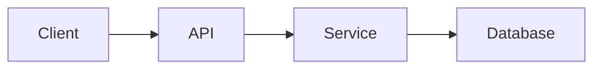
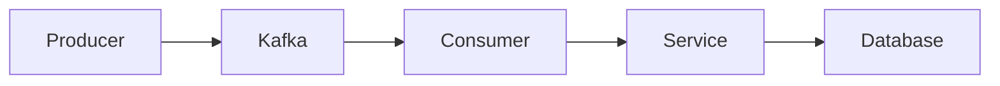

# Engineering Documentation Standard

## 1. Purpose

This steering defines the mandatory engineering documentation standard for the project.

Kiro MUST ensure that project documentation is:

- Accurate
- Traceable
- Consistent
- Verifiable
- Current
- Maintainable
- Evidence-based

Documentation MUST represent the actual implementation of the project and MUST evolve together with source code, infrastructure, tests, configuration, and architecture.

---

# 2. Source of Truth

The implementation is the primary source of truth.

Kiro MUST prioritize information sources in the following order:

1. Source code
2. Application configuration
3. Infrastructure configuration
4. Dependency manifests
5. Tests
6. CI/CD configuration
7. Existing documentation
8. Assumptions

Existing documentation MUST NOT override the actual implementation.

When documentation conflicts with implementation:

1. Inspect the implementation.
2. Determine the actual behavior.
3. Identify the discrepancy.
4. Update the documentation when documentation generation or maintenance is part of the task.
5. Report the discrepancy.

---

# 3. No Fabrication

Kiro MUST NOT invent technical, architectural, operational, business, testing, or performance information.

The following MUST NOT be fabricated:

- APIs
- business rules
- infrastructure
- databases
- caches
- message brokers
- external services
- environment variables
- technology versions
- architecture components
- resource limits
- traffic
- RPS
- latency
- test coverage
- storage growth
- capacity
- production metrics

Use the following evidence classifications:

- `Measured` — obtained from actual monitoring, production metrics, or load testing
- `Configured` — obtained from source code, configuration, deployment manifests, or infrastructure definitions
- `Calculated` — mathematically derived from verified information
- `Estimated` — based on explicit engineering assumptions
- `Unknown / Not Defined` — reliable information is unavailable

Estimated values MUST NEVER be presented as measured values.

---

# 4. Mandatory Documentation

Every project MUST maintain the following documentation:

```text
docs/
├── 01-functional-description.md
├── 02-infrastructure.md
├── 03-technology-stack.md
├── 04-data-flow.md
├── 05-unit-test-plan.md
└── 06-capacity-planning.md
```

The naming and numbering SHOULD remain consistent across projects.

---

# 5. Repository Discovery

Before generating or updating documentation, Kiro MUST inspect the repository.

Inspect the following when available:

```text
README.md
.env
.env.example
Dockerfile
docker-compose.yml
Makefile
go.mod
go.sum
package.json
package-lock.json
yarn.lock
pnpm-lock.yaml
requirements.txt
pyproject.toml
pom.xml
build.gradle
Jenkinsfile
.gitlab-ci.yml
.github/
deployment/
k8s/
helm/
terraform/
src/
cmd/
internal/
pkg/
app/
tests/
test/
```

Kiro MUST adapt discovery to the actual technology and repository structure.

The discovery SHOULD identify:

- programming language
- framework
- application structure
- API endpoints
- database
- cache
- message broker
- external services
- environment variables
- infrastructure
- deployment configuration
- CI/CD
- tests
- observability
- storage
- authentication
- authorization
- scheduled jobs
- background workers

---

# 6. Documentation Traceability

Documentation SHOULD be generated based on actual evidence.

For each significant technical statement, Kiro SHOULD be able to answer:

> Where does this information come from?

Examples:

```text
Technology:
go.mod

Database:
DATABASE_URL + database initialization code

Redis:
REDIS_HOST + Redis client initialization

Kafka:
KAFKA_BROKERS + Kafka producer/consumer implementation

Kubernetes:
deployment manifests / Helm values

Unit Test:
*_test.go

CPU:
Kubernetes/OpenShift resource configuration
```

If evidence cannot be found, use:

`Unknown / Not Defined`

---

# 7. Functional Description

File:

```text
docs/01-functional-description.md
```

The document MUST describe the actual functional behavior of the application.

Minimum structure:

```markdown
# Functional Description

## 1. Overview
## 2. Business Purpose
## 3. Scope
## 4. Actors
## 5. Functional Capabilities
## 6. Main Business Flow
## 7. Alternative Flow
## 8. Error Handling
## 9. Business Rules
## 10. External Integration
## 11. Non-Functional Requirements
## 12. Limitations
```

For each major functionality describe:

- purpose
- input
- process
- output
- validation
- business rules
- error conditions
- external dependencies

Business rules MUST NOT be invented.

If business requirements cannot be determined from the repository, state:

`Unknown / Not Defined`

---

# 8. Infrastructure Documentation

File:

```text
docs/02-infrastructure.md
```

The infrastructure documentation MUST describe infrastructure actually used by the application.

Inspect when available:

- `.env`
- `.env.example`
- application configuration
- Dockerfile
- Docker Compose
- Kubernetes manifests
- OpenShift manifests
- Helm
- Terraform
- CI/CD configuration
- connection configuration

Minimum structure:

```markdown
# Infrastructure

## 1. Infrastructure Overview
## 2. Runtime Environment
## 3. Application Runtime
## 4. Environment Variables
## 5. External Services
## 6. Database
## 7. Cache
## 8. Message Broker
## 9. Object Storage
## 10. Network Dependencies
## 11. Container / Kubernetes / OpenShift Configuration
## 12. Health Check
## 13. Resource Configuration
## 14. Infrastructure Dependency Diagram
## 15. Environment Differences
```

The documentation SHOULD identify:

- deployment platform
- application runtime
- replicas
- CPU request and limit
- memory request and limit
- exposed ports
- health checks
- database
- cache
- message broker
- storage
- external APIs
- network dependencies
- scaling configuration

---

# 9. Environment Variable Standard

Kiro MUST inspect all environment variables referenced by the application.

The documentation SHOULD contain:

| Variable | Required | Type | Purpose | Default | Environment | Dependency |
|---|---|---|---|---|---|---|

Classify variables into:

- Application
- Database
- Cache
- Message Broker
- External API
- Authentication
- Storage
- Observability
- Feature Flag
- Infrastructure

Kiro SHOULD detect:

- variables used but undocumented
- variables documented but unused
- required variables missing from `.env.example`
- duplicated variables
- environment-specific variables

Sensitive values MUST NEVER be exposed.

Never document actual:

- passwords
- API keys
- tokens
- private keys
- credentials
- secrets
- connection strings containing credentials

Use:

```text
<REDACTED>
```

---

# 10. Technology Stack

File:

```text
docs/03-technology-stack.md
```

The technology stack MUST be derived from actual dependencies and implementation.

Minimum structure:

```markdown
# Technology Stack

## 1. Programming Language
## 2. Application Framework
## 3. Libraries
## 4. Database
## 5. Cache
## 6. Message Broker
## 7. Storage
## 8. API Protocol
## 9. Authentication
## 10. Observability
## 11. Testing Framework
## 12. Build System
## 13. Containerization
## 14. Deployment Platform
## 15. CI/CD
## 16. Dependency Summary
```

For technologies, document when verifiable:

| Technology | Version | Purpose | Evidence |
|---|---|---|---|

Technology versions MUST NOT be guessed.

---

# 11. Data Flow Diagram

File:

```text
docs/04-data-flow.md
```

The data flow MUST represent the actual implementation.

Mermaid MUST be used for diagrams.

Minimum structure:

```markdown
# Data Flow

## 1. System Context
## 2. High-Level Data Flow
## 3. Request Flow
## 4. Data Processing Flow
## 5. External Integration Flow
## 6. Error Flow
## 7. Mermaid Diagrams
```

Possible components include:

```text
Client
API Gateway
API
Authentication
Handler
Controller
Service
Use Case
Repository
Database
Cache
Message Broker
External Service
Storage
Worker
Scheduler
```

Only include components that can be verified from the implementation.

---

# 12. Data Flow Analysis Procedure

When analyzing data flow, Kiro MUST:

1. Identify application entry points.
2. Identify HTTP or gRPC endpoints.
3. Identify event consumers.
4. Identify scheduled jobs.
5. Identify background workers.
6. Trace request processing.
7. Identify services and use cases.
8. Identify repositories.
9. Identify databases.
10. Identify caches.
11. Identify message brokers.
12. Identify external services.
13. Determine synchronous or asynchronous communication.
14. Generate Mermaid diagrams.
15. Validate every diagram component against implementation.

Example:



Asynchronous example:



For every important diagram component, Kiro SHOULD identify evidence.

Example:

```text
Redis

Evidence:
- REDIS_HOST
- Redis client initialization
- Redis dependency
```

---

# 13. Mermaid Standard

Mermaid diagrams MUST:

- represent actual architecture
- use consistent naming
- avoid imaginary components
- show meaningful data flow
- distinguish synchronous and asynchronous communication when relevant
- avoid unnecessary implementation detail at high-level diagrams

Kiro MUST NOT create architecture diagrams solely from assumptions.

---

# 14. Unit Test Plan

File:

```text
docs/05-unit-test-plan.md
```

The unit test plan MUST represent actual testing strategy and implementation.

Minimum structure:

```markdown
# Unit Test Plan

## 1. Testing Objective
## 2. Testing Scope
## 3. Testing Strategy
## 4. Units Under Test
## 5. Test Scenarios
## 6. Positive Cases
## 7. Negative Cases
## 8. Boundary Cases
## 9. Mocking Strategy
## 10. External Dependency Testing
## 11. Coverage Target
## 12. Test Execution
## 13. Current Test Coverage
## 14. Testing Gaps
```

---

# 15. Unit Test Analysis Procedure

Kiro MUST inspect actual test implementation.

Identify:

- test framework
- test files
- test suites
- test cases
- mocks
- fixtures
- coverage configuration
- critical paths
- untested paths

Example patterns:

```text
Go:
*_test.go

JavaScript / TypeScript:
*.test.ts
*.test.tsx
*.spec.ts
*.spec.tsx

Python:
test_*.py
*_test.py

Java:
*Test.java
```

Kiro MUST distinguish:

```text
Implemented Test
Planned Test
Missing Test
```

Never claim a test exists unless it can be verified.

Tests SHOULD cover when applicable:

- Positive cases
- Negative cases
- Boundary cases
- Validation
- Error handling
- Dependency failure
- Timeout
- Concurrency
- Authentication
- Authorization

Prioritize:

```text
Critical Business Logic
        ↓
External Integration
        ↓
Error Handling
        ↓
Validation
        ↓
Boundary Conditions
        ↓
Low-Risk Utilities
```

---

# 16. Test Coverage

If coverage reports or configuration exist, inspect them.

Document when available:

- overall coverage
- package/module coverage
- critical path coverage
- uncovered areas

If coverage cannot be verified:

```text
Coverage: Unknown / Not Defined
```

Kiro MUST NOT fabricate coverage values.

---

# 17. Capacity Planning

File:

```text
docs/06-capacity-planning.md
```

Capacity planning MUST be evidence-based.

Minimum structure:

```markdown
# Capacity Planning

## 1. Objective
## 2. Current Architecture
## 3. Traffic Assumptions
## 4. Transaction Volume
## 5. Concurrent Users
## 6. Request Rate
## 7. Response Time
## 8. CPU Requirement
## 9. Memory Requirement
## 10. Storage Requirement
## 11. Database Capacity
## 12. Database Connections
## 13. Cache Capacity
## 14. Message Broker Capacity
## 15. Network Requirement
## 16. Scaling Strategy
## 17. Bottleneck Analysis
## 18. Capacity Threshold
## 19. Growth Projection
## 20. Recommended Resources
## 21. Capacity Validation Plan
```

---

# 18. Capacity Discovery

Inspect when available:

- Dockerfile
- Docker Compose
- Kubernetes
- OpenShift
- Helm
- resource requests
- resource limits
- replica configuration
- HPA
- VPA
- node configuration
- application configuration
- database configuration
- Redis configuration
- Kafka configuration
- load test result
- APM
- monitoring
- metrics
- logs

Identify:

- CPU
- memory
- replicas
- database connections
- cache connections
- message broker configuration
- storage
- traffic
- latency
- scaling configuration

---

# 19. Capacity Evidence Classification

Every capacity value MUST use one of:

```text
Measured
Configured
Calculated
Estimated
Unknown / Not Defined
```

Examples:

```text
CPU Limit
Value: 2 cores
Status: Configured
Source: Kubernetes deployment
```

```text
Peak RPS
Value: 450
Status: Measured
Source: Load test
```

```text
Potential DB Connections
Value: 150
Status: Calculated
Source: 3 replicas × 50 connections
```

Estimated values MUST NEVER be presented as production measurements.

---

# 20. Capacity Calculation

When sufficient verified data exists, Kiro SHOULD calculate:

## Requests Per Second

```text
RPS = Total Requests / Total Seconds
```

## Daily Requests

```text
Daily Requests = Average RPS × 86,400
```

## Database Connections

```text
Total DB Connections =
Application Replicas × DB Connections Per Replica
```

## Storage Growth

```text
Daily Storage Growth =
Records Per Day × Average Record Size
```

## Annual Storage Growth

```text
Annual Storage Growth =
Daily Storage Growth × 365
```

## Required Capacity

```text
Required Capacity =
Expected Load × Safety Factor
```

The safety factor MUST be explicitly stated and documented as an assumption when it is not based on an organizational standard.

---

# 21. Capacity Planning Output

Capacity documentation SHOULD include:

| Metric | Current | Target | Threshold | Classification | Source |
|---|---:|---:|---:|---|---|

Examples of metrics:

- RPS
- p50 latency
- p95 latency
- p99 latency
- CPU
- Memory
- Replica Count
- DB Connections
- Cache Connections
- Kafka Throughput
- Consumer Lag
- Storage Growth
- Network Throughput

Do not invent values.

Use `Unknown / Not Defined` where needed.

---

# 22. Capacity Bottleneck Analysis

Analyze the end-to-end path where applicable:

```text
Client
   ↓
Load Balancer / Ingress
   ↓
Application
   ↓
Connection Pool
   ↓
Cache
   ↓
Database
   ↓
External Services
```

For each potential bottleneck document:

- component
- evidence
- current capacity
- saturation indicator
- potential failure mode
- recommendation

Potential bottlenecks MAY include:

- CPU saturation
- memory pressure
- excessive GC
- thread/goroutine exhaustion
- database connection exhaustion
- database CPU
- slow queries
- Redis client saturation
- Kafka consumer lag
- storage saturation
- network latency
- slow external API

---

# 23. Scaling Analysis

Determine whether the application supports:

- Horizontal Scaling
- Vertical Scaling
- Autoscaling
- Manual Scaling

Inspect:

- replica count
- HPA
- VPA
- statelessness
- session storage
- shared filesystem dependency
- database bottlenecks
- cache dependency
- queue or broker configuration

Document scaling limitations when identified.

---

# 24. Capacity Validation Plan

If actual production metrics are unavailable, Kiro MUST provide a validation plan instead of fabricating values.

Recommended tests:

1. Baseline test
2. Load test
3. Stress test
4. Spike test
5. Soak test

Recommended measurements:

```text
RPS
p50 latency
p95 latency
p99 latency
CPU
Memory
Database CPU
Database Connections
Cache Utilization
Network
Error Rate
Kafka Consumer Lag
Storage
```

The objective is to move capacity data from:

```text
Estimated
    ↓
Validated
    ↓
Measured
```

---

# 25. Documentation Impact Analysis

Whenever implementation changes, Kiro MUST evaluate whether documentation must also change.

Use this mapping:

| Change | Required Documentation Review |
|---|---|
| New Feature | Functional Description |
| Business Logic Change | Functional Description |
| API Change | Functional Description + Data Flow |
| New ENV Variable | Infrastructure |
| Removed ENV Variable | Infrastructure |
| Database Change | Infrastructure + Data Flow + Capacity Planning when relevant |
| New Dependency | Technology Stack |
| Framework Change | Technology Stack |
| Architecture Change | Data Flow |
| New Unit Test | Unit Test Plan |
| Test Strategy Change | Unit Test Plan |
| CPU / Memory Change | Infrastructure + Capacity Planning |
| Replica Change | Infrastructure + Capacity Planning |
| Connection Pool Change | Infrastructure + Capacity Planning |
| Scaling Change | Infrastructure + Capacity Planning |
| New External Service | Functional + Infrastructure + Technology Stack + Data Flow |
| New Message Broker | Infrastructure + Technology Stack + Data Flow + Capacity Planning |
| Deployment Change | Infrastructure + Capacity Planning |
| Storage Change | Infrastructure + Data Flow + Capacity Planning |
| Observability Change | Infrastructure + Technology Stack |

Kiro MUST evaluate documentation impact before considering an implementation task complete.

---

# 26. Documentation Drift Detection

Kiro SHOULD detect documentation drift.

Examples:

```text
Documented ENV does not exist.
Used ENV is undocumented.
Documented dependency does not exist.
Implemented dependency is undocumented.
Documented API does not exist.
Implemented API is undocumented.
Documented infrastructure does not exist.
Implemented infrastructure is undocumented.
Mermaid diagram does not match implementation.
Documented test does not exist.
Implemented test is undocumented.
Replica count is outdated.
CPU or memory configuration is outdated.
Connection pool information is outdated.
Capacity assumptions are outdated.
```

When drift is detected:

1. Report the discrepancy.
2. Determine the correct implementation.
3. Update documentation when documentation maintenance is part of the task.
4. Re-run consistency validation.

---

# 27. Cross-Document Consistency

The following documents MUST remain consistent:

```text
Functional Description
        ↕
Infrastructure
        ↕
Technology Stack
        ↕
Data Flow
        ↕
Unit Test Plan
        ↕
Capacity Planning
```

Examples:

- Database in Infrastructure MUST match Data Flow.
- Redis in Technology Stack MUST match Infrastructure.
- Kafka in Technology Stack MUST match Data Flow.
- Kubernetes/OpenShift replicas in Infrastructure MUST match Capacity Planning.
- CPU and memory configuration MUST match between Infrastructure and Capacity Planning.
- Tests documented in Unit Test Plan MUST exist or be explicitly marked Planned/Missing.
- External services in Functional Description SHOULD appear in Data Flow when technically relevant.

---

# 28. Documentation Status

Each generated document SHOULD indicate its verification status near the top.

Allowed values:

```text
Current
Partially Verified
Estimated
Outdated
Unknown
```

Example:

```markdown
> Documentation Status: Partially Verified
>
> Production traffic metrics are unavailable.
> Capacity values are based on configured resources and engineering estimates.
```

---

# 29. Documentation Audit

Before important releases, pull requests, or major implementation changes, Kiro SHOULD perform a documentation audit.

The audit MUST compare:

```text
Source Code
     ↓
Configuration
     ↓
Infrastructure
     ↓
Dependencies
     ↓
Tests
     ↓
Documentation
```

The audit SHOULD identify:

- documentation drift
- missing documentation
- unsupported claims
- cross-document inconsistencies
- outdated capacity assumptions
- undocumented environment variables
- obsolete technologies
- outdated diagrams

---

# 30. Audit Severity

Classify findings as:

## Critical

Can cause an incorrect engineering, security, deployment, or operational decision.

Examples:

- wrong database
- wrong production architecture
- incorrect security mechanism
- incorrect deployment dependency
- unsafe capacity information

## High

Significant documentation mismatch.

Examples:

- missing external service
- incorrect API flow
- incorrect infrastructure
- incorrect scaling configuration

## Medium

Incomplete information that does not immediately affect operation.

Examples:

- missing test scenario
- missing dependency description
- incomplete error flow

## Low

Minor documentation quality problem.

Examples:

- naming inconsistency
- outdated example
- formatting issue

---

# 31. Documentation Health Score

When performing an audit, Kiro MAY calculate:

```text
Documentation Score =
Verified Items / Total Audited Items × 100
```

Classification:

```text
90–100  Excellent
80–89   Good
70–79   Needs Improvement
<70     Poor
```

The score MUST be based on actual audit findings.

Kiro MUST NOT fabricate audit scores.

---

# 32. Audit Result

Return:

```text
PASS
```

when:

- no critical issues exist
- no high-priority drift exists
- mandatory documentation exists
- architecture is consistent
- infrastructure is consistent
- capacity data is correctly classified

Return:

```text
PASS WITH WARNINGS
```

when:

- no critical issues exist
- only medium or low issues exist
- documentation remains usable

Return:

```text
FAIL
```

when:

- critical issues exist
- major infrastructure mismatch exists
- architecture is incorrectly documented
- unsafe or unsupported capacity information exists
- mandatory documentation is significantly missing

---

# 33. Documentation Quality Gate

Before completing documentation work, Kiro MUST verify:

- [ ] Functional behavior matches implementation
- [ ] Infrastructure matches configuration
- [ ] Environment variables are verified
- [ ] Technology stack matches dependencies
- [ ] Mermaid diagrams match architecture
- [ ] Unit test plan matches actual tests
- [ ] Capacity values have evidence classifications
- [ ] No secrets are exposed
- [ ] No obsolete components remain
- [ ] Unknown information is explicitly marked
- [ ] Assumptions are explicitly identified
- [ ] Documentation references current implementation
- [ ] Cross-document consistency is maintained

---

# 34. Final Documentation Review

Before completing a feature or major change, Kiro SHOULD produce:

```text
Documentation Review

Functional Description: Updated / No Change
Infrastructure: Updated / No Change
Technology Stack: Updated / No Change
Data Flow: Updated / No Change
Unit Test Plan: Updated / No Change
Capacity Planning: Updated / No Change

Documentation Gaps:
- ...

Assumptions:
- ...

Unknown Information:
- ...

Documentation Drift:
- ...

Validation Required:
- ...
```

---

# 35. Recommended Workflow

For a new project:

```text
Repository Discovery
        ↓
Functional Analysis
        ↓
Infrastructure Analysis
        ↓
Technology Stack Analysis
        ↓
Data Flow Analysis
        ↓
Unit Test Analysis
        ↓
Capacity Analysis
        ↓
Generate Documentation
        ↓
Cross-Document Validation
        ↓
Documentation Audit
        ↓
Quality Gate
```

For an existing project change:

```text
Code Change
    ↓
Documentation Impact Analysis
    ↓
Update Affected Documents
    ↓
Cross-Document Validation
    ↓
Documentation Audit
    ↓
Quality Gate
```

---

# 36. Read-Only Audit Principle

Documentation audit is read-only by default.

During an audit Kiro MUST NOT modify:

- source code
- infrastructure
- application configuration
- tests
- deployment manifests

Documentation MAY be modified when:

- explicitly requested by the user
- documentation generation is part of the task
- documentation synchronization is explicitly part of the requested work

---

# 37. Documentation Ownership

Documentation is part of the software development lifecycle.

```text
Requirement
    ↓
Design
    ↓
Implementation
    ↓
Testing
    ↓
Documentation
    ↓
Review
    ↓
Deployment
    ↓
Monitoring
    ↓
Capacity Analysis
    ↓
Continuous Documentation Update
```

Documentation MUST NOT be treated as a one-time deliverable.

---

# 38. Final Engineering Principle

The objective is not to create the largest possible documentation.

The objective is to create documentation that is:

```text
Accurate
+
Traceable
+
Current
+
Consistent
+
Evidence-Based
```

When information is unknown, explicitly state:

`Unknown / Not Defined`

Never replace missing evidence with assumptions presented as facts.

The implementation is always the primary source of truth.
